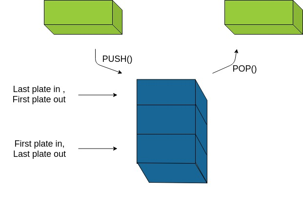
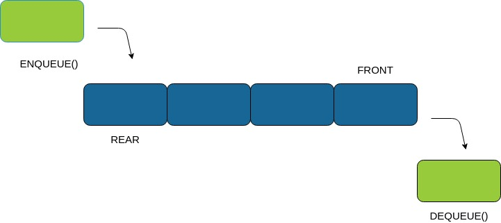

### Key Differences Between Stack and Queue

    Stack follows LIFO mechanism whereas Queue follows FIFO mechanism to add and remove elements.
    In a stack, the same end is used to insert and delete the elements. On the contrary, two different ends are used in the queue to insert(Rear) and delete(Front) the elements.
    As Stacks have only one open end, that is the reason for using only one pointer to refer to the top of the stack. But queues use two pointers to refer to the front and the rear ends of the queue.
    Stack performs two operations known as push and pop while in Queue its known as enqueue and dequeue.

### Stacks : Example

### Queues : Example

