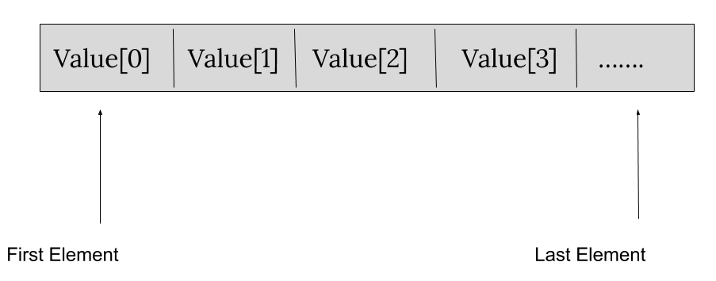

### Arrays

    Arrays are a kind of data structure that can store a fixed-size sequential collection of elements of the same type. An array is used to store a collection of data, but it is often more useful to think of an array as a collection of variables of the same type.
    Instead of declaring individual variables, such as value0, value1, ..., and value99, you declare one array variable such as value and use value[0], value[1], and ..., value[99] to represent individual variables. A specific element in an array is accessed by an index.
    All arrays consist of contiguous memory locations. The lowest address corresponds to the first element and the highest address to the last element.

### Arrays Visualization

### Time and Space Complexity

    Time complexity of an algorithm gives the measure of time taken by it to run as a function of the length of the input. Similarly, Space complexity of an algorithm quantifies the amount of space or memory taken by an algorithm to run as a function of the length of the input.
    Recall that suppose our input is an array of N elements, and our algorithm iterates through the array once, time complexity will be O(N). If I run two embedded loops to traverse the array N times, time complexity will be O(N2).

