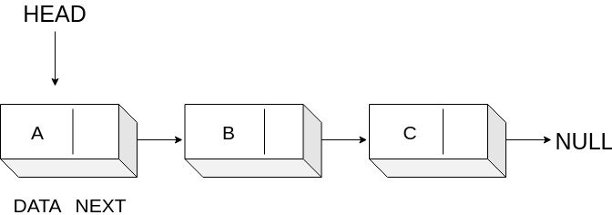

### Linked Lists

   - A disadvantage of array is that they are static hence they are not easily extended or reduced. So we will look into another similar data structure called **Linked Lists**.
    A linked list is a linear dynamic data structure where each element is a separate object. Each element (referred as node) of a list comprises two items - the data and a reference to the next node.
  -  The entry point of the linked list is referred by the **HEAD** and the last node is referred to as null.
    If the list is empty then head itself refers to null.
    Number of nodes are not fixed which can increase or decrease based on the demand.

  -  Disadvantage of linked list against array is that it doesn't allow direct access to individual elements. That is, access time of a particular node is O(n) instead of O(1).
    And another disadvantage is memory. Linked list uses extra 4 bytes to store reference to the next node.

### Linked List Visualization

### Time Complexity

  -  A linked list is typically accessed from the **HEAD** node. We reach the desired node by travelling through the linked list from head node and if we assume there are N nodes in the linked list then time taken to access/search a node is O(N).
  -  Inserting into a linked list requires re-pointing the previous node (the node before the insertion node) to the inserted node, and pointing the newly-inserted node to the next node. **Thus insertion is O(1)**.
  -  Deleting from a linked list requires re-pointing the previous node (the node before the deleted node) to the next node (the node after the deleted node). **Thus deletion is O(1)**.

