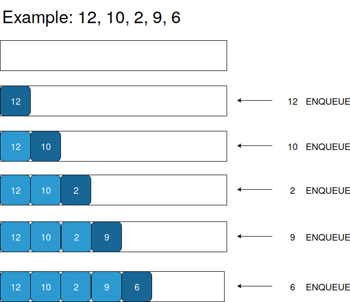
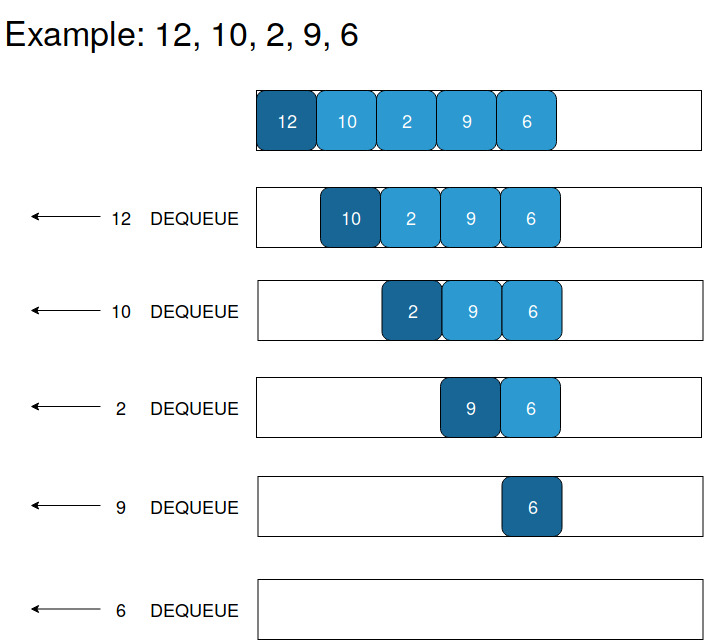

### Queues Concept
<iframe src="https://www.youtube.com/embed/L0_MohAei8w" frameborder="0" allow="autoplay; encrypted-media" allowfullscreen></iframe>

### What are Queues?

  - Imagine a line of people waiting at a ticket counter. People are served in the order they come, that is, people who come first are served first whereas people who come later are served after that.
  -  Let the action of someone joining a queue be called enqueue and someone being serve and getting out of the queue be called dequeue.
  -  A type of structure, similar to the example of the line of people, can be represented as a data structure. Such a data structure is known as a queue.

### Types of Queues

   - SIMPLE QUEUE : A simple queue is a type of queue where insertion is at the end of the queue and removal is at the front.
   - CIRCULAR QUEUE : A circular queue is a type of queue where the last element is connected to the first. An element is added to the end of the queue and removed from the front.
   - PRIORITY QUEUE : A priority queue is a type of queue where the elements are arranged in some priority order. An element with the highest priority is removed first and insertion occurs according to the priority.
   - DOUBLE ENDED QUEUE : A double ended queue is a type of queue where insertion and deletion can happen at both ends of the queue.

### Queue Operations and Applications

  -  Just like how we saw in the example of the queue of people, a queue data structure has two types of operations : enqueue and dequeue. As we can see, a queue is an example of a first in, first out data structure (FIFO). That is, an element that is enqueued first is the first to be dequeued.Enqueue operation happens at "REAR" pointer whereas dequeue operation happens at "FRONT" pointer.
  -  Queues have a variety of applications. Lets explore a few of them. -> Processing requests in a website : When a website is visited by a large number of users, it puts the users in a queue - users that vists the website first are processed earlier. -> Priority Queue in Operating Systems : An operating system has many tasks to perform and tasks are ordered according to the most important ones. This makes use of multilevel priority queues.

### Enqueue Operation

### Dequeue Operation

